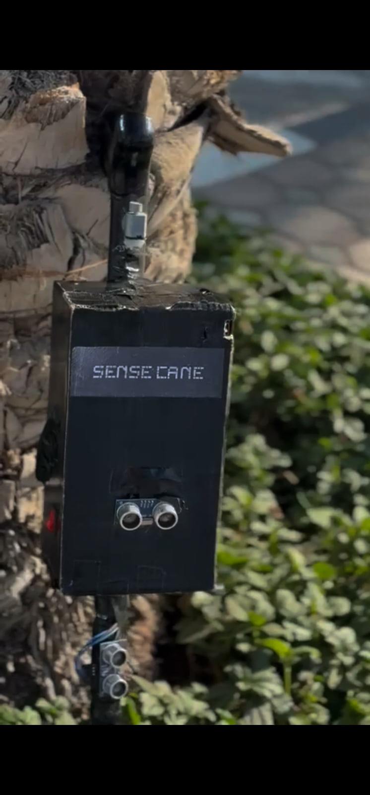

# Sense Cane

<p align="center">
  
</p>

<p align="center">
  <em>A low-cost open source smart cane for the visually impaired.</em>
</p>

---

Three ultrasonic sensors detect obstacles at different heights and communicate them through distinct vibration patterns on a single motor — no audio, no app, no phone required.

---

## Demo

[](https://youtube.com/shorts/aLXwnegcbWA)

---

## How it works

The cane uses one vibration motor as its only feedback channel. The number of buzzes tells you where the obstacle is.

| Sensor Triggered | Pattern |
|---|---|
| High only (head/chest) | SINGLE PULSE |
| Medium only (waist/hip) | DOUBLE PULSE |
| Low only (ground/ankle) | TRIPLE PULSE |
| Medium + High | SINGLE + DOUBLE PULSE |
| Low + High | SINGLE + TRIPLE PULSE |
| Low + Medium | DOUBLE + TRIPLE PULSE |
| All three | SINGLE + DOUBLE + TRIPLE PULSE |

The pattern repeats continuously as long as an obstacle is in range. The moment you move clear, it goes silent.

---

## What's in this repo

```
sense-cane/
├── SenseCane_Final.ino        # Main Arduino sketch (flash this)
├── SenseCane_BuildGuide.pdf   # Full wiring diagram, assembly steps, component list
├── sense-cane.jpg             # Hardware photo
└── README.md
```

---

## Quick start

1. Download `SenseCane_BuildGuide.pdf` and assemble the hardware
2. Open `SenseCane_Final.ino` in Arduino IDE
3. Select **Arduino Nano** and your COM port
4. Hit upload

Thresholds and vibration timing are all defined at the top of the sketch — tune them to your environment before flashing.

---

## Hardware overview

- Arduino Nano
- 3x HC-SR04 Ultrasonic Sensors
- Vibration Motor + MOSFET (gate on pin 9)
- 26650 Battery + TP4056 charging module
- DC-DC Step-Up Booster (5V output)

Full component list with quantities, sources, and wiring is in the build guide.

---

## Why this design

Most assistive cane projects rely on audio feedback — a speaker or buzzer that announces obstacles out loud. That creates a problem: the user has to sacrifice one of their primary remaining senses to use the device. Sense Cane uses vibration only, leaving hearing completely free for the environment.

A single motor with patterned feedback was chosen over multiple motors to keep the build simple, affordable, and reproducible anywhere in the world.

The Sense Cane was designed particularly to meet affordability needs and achieve smart obstacle-detection in the most affordable way possible.

---

## Contributing

Pull requests are welcome. If you build this, run into issues, or improve on the design — open an issue or submit a PR. The goal is to make this better for everyone who needs it.

---

## License

MIT — free to use, modify, and distribute.

---

*Built by Talha Baig*
